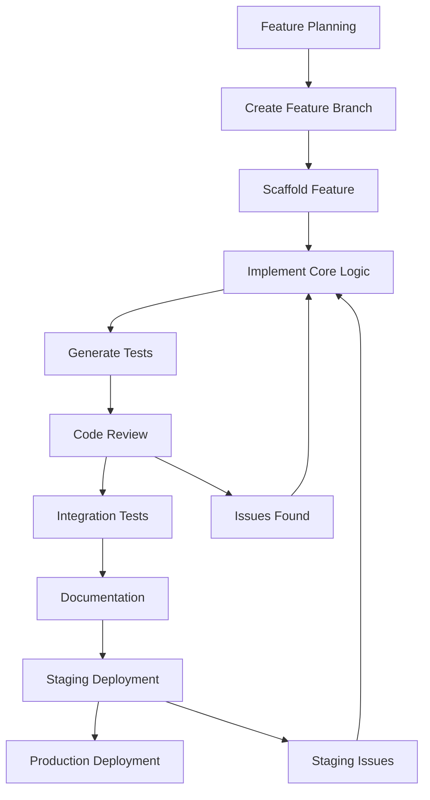

# Feature Development Workflow

A comprehensive workflow template for developing features using the Claude Code modular framework with quality gates, testing, and deployment automation.

## Workflow Overview



## Phase 1: Planning and Setup

### 1.1 Feature Planning

**Objective**: Define feature requirements and scope

**Actions**:
- Review feature requirements and acceptance criteria
- Identify integration points and dependencies
- Estimate complexity and timeline
- Create feature specification document

**Commands**:
```bash
# Analyze existing codebase for patterns
/dev:refactor-analysis --focus=architecture

# Create feature specification
/docs:architecture-review --focus=new-feature
```

### 1.2 Branch Creation

**Objective**: Create isolated development environment

**Actions**:
- Create feature branch from main
- Set up branch protection if needed
- Link to issue tracker (Linear, GitHub Issues)

**Commands**:
```bash
# Create and switch to feature branch
git checkout -b feat/feature-name

# Push branch to origin
git push -u origin feat/feature-name
```

## Phase 2: Implementation

### 2.1 Feature Scaffolding

**Objective**: Create feature structure and boilerplate

**Actions**:
- Generate feature files following project conventions
- Create component structure
- Set up routing and navigation
- Initialize state management

**Commands**:
```bash
# Create complete feature structure
/project:create-feature feature-name

# Or scaffold individual components
/project:scaffold-component FeatureComponent
```

### 2.2 Core Implementation

**Objective**: Implement feature functionality

**Actions**:
- Implement core business logic
- Add input validation and error handling
- Integrate with external services
- Follow established patterns and conventions

**Quality Checkpoints**:
- Code follows project style guide
- Error handling is comprehensive
- Security best practices followed
- Performance considerations addressed

## Phase 3: Testing

### 3.1 Unit Test Generation

**Objective**: Create comprehensive unit test coverage

**Actions**:
- Generate tests for all new functions
- Test positive and negative scenarios
- Include boundary condition testing
- Verify error handling

**Commands**:
```bash
# Generate comprehensive unit tests
/test:generate-tests --types=unit

# Analyze test coverage
/test:coverage-analysis
```

### 3.2 Integration Testing

**Objective**: Test component interactions

**Actions**:
- Test API endpoints and data flow
- Verify database operations
- Test external service integrations
- Validate user workflows

**Commands**:
```bash
# Generate integration tests
/test:integration-tests

# Run specific integration test suites
/test:integration-tests --focus=api
```

## Phase 4: Quality Assurance

### 4.1 Code Review

**Objective**: Ensure code quality and security

**Actions**:
- Automated code quality analysis
- Security vulnerability scanning
- Performance impact assessment
- Architecture compliance check

**Commands**:
```bash
# Comprehensive code review
/dev:code-review

# Security-focused review
/dev:code-review --focus=security,performance
```

### 4.2 Refactoring and Optimization

**Objective**: Improve code quality and performance

**Actions**:
- Address code review findings
- Optimize performance bottlenecks
- Refactor complex code sections
- Improve error handling

**Commands**:
```bash
# Identify refactoring opportunities
/dev:refactor-analysis

# Debug performance issues
/dev:debug-session --type=performance
```

## Phase 5: Documentation

### 5.1 API Documentation

**Objective**: Document new APIs and interfaces

**Actions**:
- Generate API documentation
- Create usage examples
- Document error responses
- Update API versioning

**Commands**:
```bash
# Generate API documentation
/docs:api-docs

# Update README with new feature
/docs:update-readme --highlight-features
```

### 5.2 Architecture Documentation

**Objective**: Update system architecture documentation

**Actions**:
- Update architecture diagrams
- Document design decisions
- Create migration guides
- Update deployment documentation

**Commands**:
```bash
# Review and update architecture docs
/docs:architecture-review
```

## Phase 6: Deployment

### 6.1 Staging Deployment

**Objective**: Deploy to staging environment for validation

**Actions**:
- Deploy to staging environment
- Run smoke tests
- Validate feature functionality
- Collect stakeholder feedback

**Commands**:
```bash
# Prepare release for staging
/deploy:prepare-release --type=feature --environment=staging

# Deploy to staging
/deploy:deploy-staging
```

### 6.2 Production Deployment

**Objective**: Deploy to production environment

**Actions**:
- Final quality gate validation
- Deploy to production
- Monitor deployment health
- Verify feature functionality

**Commands**:
```bash
# Prepare production release
/deploy:prepare-release --type=minor

# Deploy to production (if approved)
/deploy:deploy-production
```

## Quality Gates

### Pre-Implementation Gates

- [ ] Feature requirements clearly defined
- [ ] Architecture impact assessed
- [ ] Dependencies identified
- [ ] Timeline and scope agreed upon

### Pre-Testing Gates

- [ ] Core functionality implemented
- [ ] Code follows project conventions
- [ ] Error handling implemented
- [ ] Security considerations addressed

### Pre-Deployment Gates

- [ ] All tests passing (unit, integration, e2e)
- [ ] Code coverage meets standards (>80%)
- [ ] Security scan passes
- [ ] Performance benchmarks met
- [ ] Documentation updated

### Pre-Production Gates

- [ ] Staging validation successful
- [ ] Stakeholder approval obtained
- [ ] Monitoring and alerting configured
- [ ] Rollback procedure tested

## Rollback Procedures

### Staging Rollback

```bash
# Rollback staging deployment
/deploy:rollback-procedure --environment=staging
```

### Production Rollback

```bash
# Emergency production rollback
/deploy:rollback-procedure --environment=production --emergency
```

## Best Practices

### Development

1. **Small, incremental commits** - Commit early and often
2. **Clear commit messages** - Use conventional commit format
3. **Regular code reviews** - Review code before merging
4. **Comprehensive testing** - Test happy path and edge cases
5. **Documentation updates** - Keep docs current with code

### Testing

1. **Test-driven development** - Write tests before implementation
2. **Realistic test data** - Use production-like data
3. **Edge case testing** - Test boundary conditions
4. **Performance testing** - Validate performance requirements
5. **Security testing** - Test for vulnerabilities

### Deployment

1. **Environment parity** - Keep environments similar
2. **Automated deployment** - Use CI/CD pipelines
3. **Monitoring setup** - Monitor deployment health
4. **Gradual rollout** - Use feature flags for controlled release
5. **Rollback readiness** - Always have rollback plan

## Common Issues and Solutions

### Development Issues

**Issue**: Feature complexity exceeds estimates
**Solution**: Break into smaller features, reassess scope

**Issue**: Integration challenges with existing code
**Solution**: Use `/dev:refactor-analysis` to identify patterns

**Issue**: Performance impact on existing features
**Solution**: Use `/dev:debug-session --type=performance`

### Testing Issues

**Issue**: Low test coverage
**Solution**: Use `/test:generate-tests` and `/test:coverage-analysis`

**Issue**: Flaky tests
**Solution**: Review test data and timing issues

**Issue**: Integration test failures
**Solution**: Use `/test:integration-tests --debug`

### Deployment Issues

**Issue**: Staging deployment fails
**Solution**: Use `/deploy:rollback-procedure --environment=staging`

**Issue**: Production issues discovered
**Solution**: Use `/deploy:rollback-procedure --emergency`

## Metrics and Monitoring

### Development Metrics

- **Feature completion time**
- **Code review cycle time**
- **Bug detection rate**
- **Test coverage percentage**

### Quality Metrics

- **Code quality scores**
- **Security vulnerability count**
- **Performance benchmarks**
- **Documentation completeness**

### Deployment Metrics

- **Deployment success rate**
- **Time to deploy**
- **Rollback frequency**
- **Feature adoption rate**

## Continuous Improvement

### Weekly Reviews

- Review feature development metrics
- Identify workflow bottlenecks
- Collect team feedback
- Update workflow documentation

### Monthly Assessments

- Analyze feature quality trends
- Review deployment success rates
- Assess team productivity
- Plan workflow improvements

---

**This workflow template provides a structured approach to feature development with built-in quality gates and automation.**